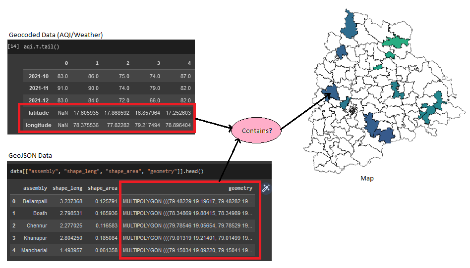
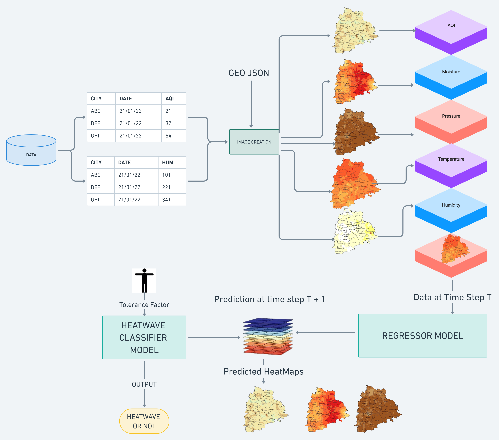

### Telangana Academic Grand Challenge on Climate Change
This repository is for the project for the Academic Grand Challenge on Climate Change Hackathon conducted by Nasscom in Collaboration with the Telangana Government and Capgemini
## Table of Contents
- [Getting Started](#getting-started)
- [Problem Statment](#problem-statement)
- [About the Problem](#about-the-problem)
- [Our Understanding](#our-understanding)
- [Prototype](#prototype)
    - [Data Preprocessor](#data-preprocessor)
    - [AI Based Predictor](#ai-based-predictor)
    - [Application](#application)
- [Architecture Diagram](#architecture-diagram)
- [Submissions](#submissions)
- [Authors](#authors)

## Problem Statement
 - Building an AI/ML model that predicts the occurrences of heat waves and the Air Quality Index (AQI) for Adilabad, Nizamabad, Warangal, Karimnagar, and Khammam.

## About the Problem
- The goal of the challenge is to predict heatwave occurrence and AQI trends in tier 2 cities of Telangana. 
- The data provided includes Weather, AQI, Energy Consumption and Vehicle sales in various cities of the state on a monthly basis.

## Our Understanding
- We aim to solve this problem by dividing it into 2 parts:
  - Regression:  the variables like the AQI, Energy Consumption, etc, are continuous in nature, so we could build a possible estimate to these values, based on a linear
  combination of the input variables. With this, we plan to estimate the AQI, temperature and other parameters.
  - Classification: with the AQI, temperature and the other parameters predicted, we create a classifier to categorize whether given a set of weather parameters, contribute a heatwave or not. This model also takes into consideration, a parameter tolerance (), which can be set/used by the users/governing bodies to set the threshold, for determining if the weather parameters is a heatwave or not.

## Prototype
 - It is divided into three modules

   - Data Preprocessor
   - AI Based Predictor
   - Application

## Data Preprocessor
 - This module converts csv data of into heatmaps using a combination of Geocoding and Plotting.

## AI Based Predictor
 - We use an auto-regressive Image-to-Image model to generate heatmaps for future predictions.
 - The majority of cutting-edge methods for weather and climate modelling are based on numerical techniques for the atmosphere that are grounded in physical theory. These strategies try to mimic the difficult-to-model non-linear dynamics and intricate interactions between several factors. However, a lot of these numerical techniques need a lot of computing, especially when modelling atmospheric phenomena with precise spatial and temporal resolution. Instead, more recent machine learning-based data-driven techniques seek to directly address a downstream forecasting or projection issue by training a data-driven functional mapping. These networks lack the generality of numerical models since they are trained with selected and homogenous climatic information for certain spatiotemporal goals.
- To capture the spatial data, what we try to do is, convert the AQI values and other values such as:
    1. Maximum Humidity
    2. Maximum Temperature
    3. Maximum Wind Speed
    4. Minimum Humidity
    5. Minimum Temperature
    6. Minimum Wind Speed
    7. Rain

- With all these parameters, we build a multi-channel image input, which is processed through a bunch of convolutional layers which extract latent representations of the current atmospheric state of Telangana and these representations are later passed into a recurrent model to learn information regarding trend, seasonality, noise etc. 

- To implement these recurrent units, we use the LSTM cells to learn the vector representations of the model. We use a window size of 5 in this use case (although this is a hyper-parameter and we would want to experiment with variable values). We extract the spatiotemporal information of these `window_size` samples and the extract the representations of the same.

- As for the metrics, we use the __Mean Square Error__, __SSIM__ and the __PSNR__. Since, this is a spatiotemporal sequence prediction task, we need to consider other support losses also. In this case, SSIM and PSNR act as the support losses and are used to validate the model through out.

- The model is __generative__ in nature and is expected to do regression of all the cities and mandals of entire Telangana. We make sure that the outputs produce results in the same shape of the Telangana map, which makes it easier for us as we as, the users, clients and the investors to understand what the idea behind the model is, since it easier to interpret images more than numerical statistics.

## Application
 - This section is under Work in Progress
 
## Architecture Diagram

## Submissions
* ## Presentation Link: [Link](https://www.canva.com/design/DAFY8GB2U2M/5X7AZBh-cOCI0rQWTHx8AA/view)
* ## Figma Link: [Link](https://www.figma.com/file/QpFcYibSUP9y78nOjzLIJW/Map-Maker)

## Authors

#### Neeraj J Manurkar
* [GitHub](https://github.com/Neerajjr11)
* [LinkedIn](https://www.linkedin.com/in/neeraj-j-manurkar-64372b212/)

#### Pratik Garai
* [GitHub](https://github.com/iaraGkitarP)
* [LinkedIn](https://www.linkedin.com/in/pratik-garai-bab1a4191/)

#### Aravind P
* [GitHub](https://github.com/ARAVIND1828)
* [LinkedIn](https://www.linkedin.com/in/aravind-p-92a5061b8/)

#### Aneesh Aparajit G
* [GitHub](https://github.com/aneeshaparajit)
* [LinkedIn](https://www.linkedin.com/in/aneesh-aparajit/)
